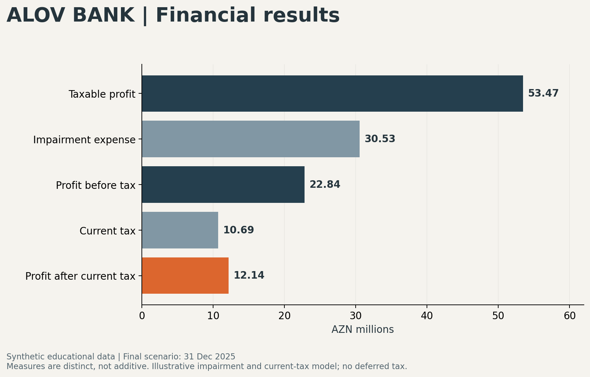
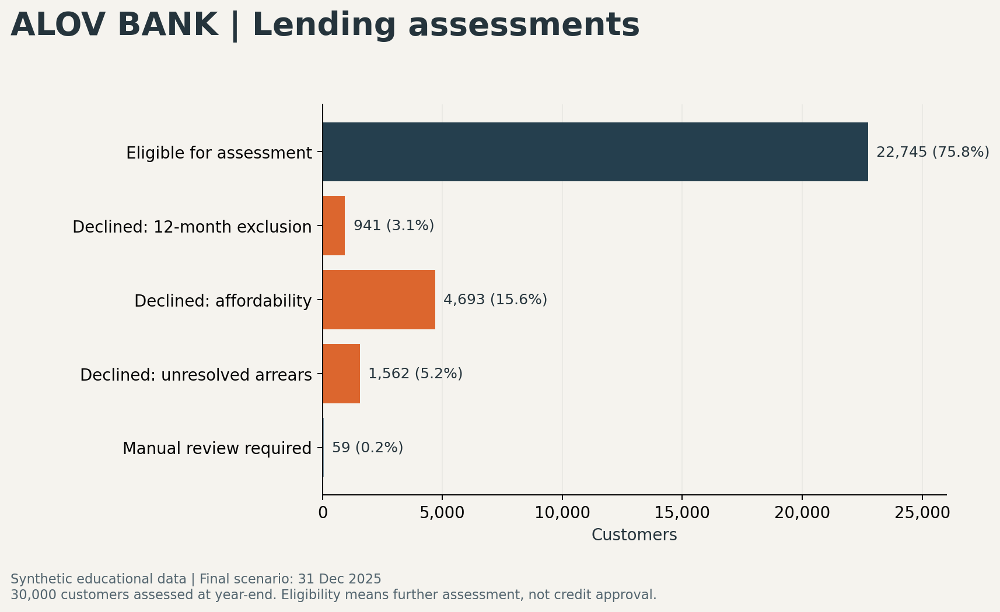
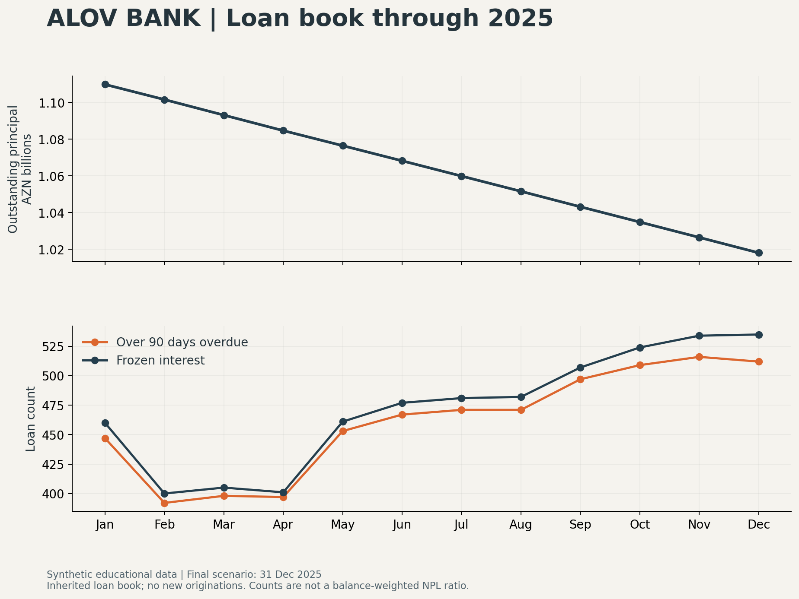

# Alov Bank — Banking Analytics & SQL Portfolio

**A fictional Azerbaijani banking scenario for learning SQL, credit-risk analysis and financial reporting.**

**Author:** Nihat Şıxəliyev  
**Reporting date:** 31 December 2025, inclusive  
**Main technologies:** MySQL, Python and DbGate  
**Currency:** Azerbaijani manat (AZN)

> **Educational use only.** Alov Bank is a fictional project, not a real or licensed financial institution. All customer records and financial scenarios are synthetic. This project does not represent, reproduce in full, replace or substitute for any real bank, banking structure, core banking platform, accounting system, regulatory framework or professional banking service. It must not be used to process real customer funds, make real credit decisions, prepare actual tax filings or establish regulatory compliance. Its calculations, policies and conclusions are learning examples, not financial, legal, tax or investment advice. References to real banks are research examples, not affiliations or endorsements.

## The idea behind Alov Bank

“Alov” means “flame” in Azerbaijani. The name gives this educational portfolio a local identity and suggests energy, curiosity and progress. The singular **Alov Bank** describes one fictional institution with multiple branches.

The project examines how a bank's loan balances, payment behaviour, lending decisions, premises costs and tax estimates relate to one another. Its purpose is to explain the financial story behind the tables, rather than present a large dataset without context.

The main questions are:

- How much principal remains after reconstructing repayments from loan origination?
- What happens to interest and overdue records when customers delay, partly pay or stop paying?
- How should income, existing obligations and past arrears restrict further borrowing?
- How do restructuring choices change monthly obligations and projected interest?
- How do premises costs and tax adjustments affect reported profitability?
- Which reconciliation checks support the results, and which limitations remain?

## Final portfolio version

After repeated refinements and validation, **this is the final database for the current Alov Bank portfolio**: `banking_portfolio_2025`, reporting at 31 December 2025. All figures, charts, analysis and installation instructions in this repository refer to this version. Superseded database downloads and their reports have been removed from the current branch; earlier commits retain the development history.

Loan payments use an external settlement assumption. This database does not include deposit-account transactions or a consolidated cash/general ledger. The final-version label describes the selected portfolio release, not a production-ready banking system.

Download the database using the [final database guide](data/README.md).





## Dataset at a glance

| Measure | Coverage |
|---|---:|
| Synthetic customers | 30,000 |
| Branches | 25 |
| Original loan contracts reconstructed | 16,000 |
| Recorded loan payments, from origination through 2025 | 654,730 |
| Loan month-end records | 718,931 |
| Arrears episodes across reconstructed history | 97,039 |
| Executed restructurings in 2025 | 930 |
| Monthly income observations, July 2020–December 2025 | 1,980,000 |
| Monthly lending assessments during 2025 | 360,000 |
| Rented / owned branches | 20 / 5 |

Original loans were issued between 2021 and 2024. Reconstructing their opening history is necessary to calculate consistent 2025 balances. Record counts covering the full reconstructed history must not be labelled as 2025-only activity.

The reporting clock stops at **31 December 2025**. Later cash payments and executed restructurings are excluded. January 2026 restructuring remains a future project. Contract maturities and eligibility dates may fall after the cutoff because they are obligations or dates already known at year-end, not completed future transactions.

## Financial results at 31 December 2025

| Measure | AZN |
|---|---:|
| Outstanding loan principal | 1,018,104,629.34 |
| Profit before tax | 22,836,777.83 |
| Illustrative credit-loss expense | 30,525,628.50 |
| Taxable profit before prior-loss relief | 53,465,361.48 |
| Current corporate profit tax | 10,693,072.30 |
| Synthetic tax advances already paid | 4,811,882.55 |
| Remaining current tax payable | 5,881,189.75 |
| Profit after current tax | 12,143,705.53 |

**Principal is not income.** It is money originally lent that customers still owe. Principal collections reduce the loan asset; interest and eligible fees contribute to income. Accounting profit is also not the same as cash available to spend.

Outstanding principal is calculated from original loan contracts and reconstructed principal repayments; it is not a measure of new loan originations.

### Why taxable profit exceeds accounting profit

The largest adjustment is the illustrative credit-loss allowance. The model recognises it as an accounting expense but assumes it is not tax deductible in this illustration, so it is added back. Premises accounting and tax depreciation also differ.

| Reconciliation | AZN |
|---|---:|
| Accounting profit before tax | 22,836,777.83 |
| Add back lease accounting costs | +1,530,815.41 |
| Deduct contractual rent | −1,333,476.00 |
| Add back owned-building accounting depreciation | +52,435.70 |
| Deduct model tax depreciation | −146,819.96 |
| Add back illustrative credit-loss expense | +30,525,628.50 |
| **Taxable profit** | **53,465,361.48** |

The model applies 20% to positive taxable profit. Therefore, current tax exceeds 20% of accounting profit without contradicting the model's tax rate. This is not a claim that all real bank provisions are non-deductible.

Current tax payable equals current tax expense minus advances paid. Profit after current tax deducts the entire current-year tax expense, including the unpaid portion. Deferred tax is excluded, so this measure is not labelled a complete IFRS net-profit result.

## What the monthly results show

| Month-end, 2025 | Outstanding principal (AZN) | Loans over 90 days overdue | Loans with frozen interest |
|---|---:|---:|---:|
| January | 1,109,843,302.13 | 447 | 460 |
| February | 1,101,603,538.48 | 392 | 400 |
| March | 1,093,130,679.96 | 398 | 405 |
| April | 1,084,679,404.33 | 397 | 401 |
| May | 1,076,485,956.63 | 453 | 461 |
| June | 1,068,227,506.05 | 467 | 477 |
| July | 1,059,915,202.17 | 471 | 481 |
| August | 1,051,611,870.95 | 471 | 482 |
| September | 1,043,183,746.35 | 497 | 507 |
| October | 1,034,865,921.10 | 509 | 524 |
| November | 1,026,504,072.30 | 516 | 534 |
| December | 1,018,104,629.34 | 512 | 535 |

Outstanding principal declines as the inherited loan book is repaid; the historical component does not simulate new 2025 originations. The decline is therefore not, by itself, evidence of weak lending demand or a successful credit strategy.

The count over 90 days overdue rises from 447 at January-end to 512 at December-end. This indicates more seriously overdue loans within the generated scenario, but a count is not a balance-weighted non-performing-loan ratio. It also counts loans rather than distinct borrowers.

Frozen-interest counts can exceed the count currently over 90 days overdue. A partial payment may clear the oldest overdue instalment and reduce the displayed days past due while other arrears remain. The continuous episode's interest cap stays in effect until those arrears are cleared.

## Loan repayments and interest

Original principal, issue dates and annual rates are retained as source inputs. Source outstanding balances remain available in `source_outstanding`; recalculated principal appears in `outstanding_amount`.

| Feature | Implemented treatment |
|---|---|
| Repayment schedule | Equal-principal schedule; first payment due at the end of the issue month |
| Interest calculation | Simple daily interest on unpaid principal, using Actual/365 |
| Interest compounding | None |
| Extra penalty interest | None |
| Payment allocation | Due interest first, then oldest due principal |
| Customer behaviour | Reliable payments, occasional/repeated delays, long delays and stopping payments |
| Income shocks | Can introduce payment delays |
| Reconciliation | Original principal minus principal paid equals outstanding principal; accrued interest minus interest paid equals interest receivable |

`interest_accrued` represents interest earned in a period. `interest_paid` represents cash collected and can include older unpaid interest. It can fluctuate because of month lengths, changes in unpaid principal, delayed collections and partial payments. A changing collected amount does not automatically mean the contractual rate changed.

### Ninety-day interest policy

This is an **agreed project policy**, not a verified statement of Azerbaijani banking law:

1. Count an uninterrupted arrears episode from the missed due date.
2. Allow at most 90 charged overdue days within that episode.
3. Freeze **all new loan interest** after that allowance is exhausted; existing principal and interest remain owed.
4. Keep recording the actual overdue days even when the delay reaches 160 days or more.
5. Do not reset the allowance for a partial payment while arrears remain.
6. After all billed arrears are cleared, resume normal interest accrual the next day. A separate later episode has its own 90-day allowance.

This freeze is not a debt write-off, a complete regulatory non-accrual policy or an IFRS accounting conclusion.

### Restructuring

Selected loans with 30–60-day arrears are restructured on a month-start during 2025. The model records the effective date, original and revised rates, remaining terms, principal, carried interest and projected interest under each option.

- A rate increase is applied **only at restructuring**, by one percentage point in the generated scenario.
- The alternative reduces the annual rate by one percentage point and extends the term.
- New terms are selected to produce greater nominal projected interest than the old remaining schedule, assuming timely payment.
- Unpaid interest is carried separately and is not added to principal.
- Rescheduled due items remain visible; restructuring is not represented as a cash repayment.

More projected interest does not guarantee more profit. Longer exposure, funding costs, collection costs, defaults and the time value of money can change the economic result.

## Customer income and borrowing eligibility

Each customer has a synthetic monthly net-income history and estimated essential expenses. The existing annual-income field is an anchor, not a verified gross-to-net conversion or a population-income estimate. Account deposits are not automatically treated as salary.

Lending assessments use six observed months of income, existing obligations and repayment history available at each 2025 assessment date. They do not use future arrears to change an earlier decision.

| Repayment history | Maximum total monthly debt payments / net income |
|---|---:|
| Established history without delays | 35% |
| No previous loan history | 25% |
| Occasional delays up to 30 days | 25% |
| Repeated episodes or a 31–60-day delay | 15% |
| A 61–90-day delay | 10%, subject to manual review |
| Previous delay over 90 days, exclusion completed | 10%, subject to manual review |
| Active arrears or uncompleted exclusion | No new offer |

After a delay exceeding 90 days, the customer receives no new loan offer for **12 calendar months after all arrears are paid**. New arrears during that exclusion restart the wait once cleared, across the customer's loans. Restructuring remains possible; expiry only permits reassessment, not automatic approval.

The percentages and 12-month-after-clearance rule are internal simulation choices. They are not represented as mandatory Azerbaijani rules or the exact policies of the banks referenced in the research.

Available payment capacity is the smaller of:

```text
(average net income × policy percentage) − existing monthly debt payments
average net income − essential expenses − existing monthly debt payments
```

Negative capacity is set to zero. The displayed new principal limit uses an illustrative personal-loan annuity at **18% annually for 36 months**. This is distinct from the existing equal-principal loan schedules and is not a mortgage, collateral or business-loan approval model.

### Year-end assessment outcomes

| Result | Customers |
|---|---:|
| Eligible for further assessment | 22,745 |
| Declined: affordability | 4,693 |
| Declined: unresolved arrears | 1,562 |
| Declined: 12-month exclusion | 941 |
| Manual review required | 59 |

Eligibility does not indicate actual demand, an offer or a loan disbursement. Existing loans are inherited exposures; the new policy is not applied retrospectively to claim their original approvals met it.

## Premises, expenses and tax assumptions

Branches 1–5 are assumed bank-owned; branches 6–25 rented. Areas, prices and ownership allocation are synthetic.

Rented premises use five-year leases beginning on 1 January 2025 and an assumed 10% annual discount rate. The model records right-of-use assets, lease liabilities, depreciation, lease interest and payment splits. Refundable deposits are separate from rental expenses. Only 2025 activity is posted.

Gross rent paid to resident individual landlords is split between landlord cash and 14% rental withholding in the model. Resident-company landlords have no such withholding and are assumed non-VAT-registered. December withholding remains payable; previous months' withholding is remitted in subsequent months. Withholding is not an extra rent expense on top of the same gross contractual rent.

Owned buildings use an assumed 40-year accounting life, no residual value, no land component and no opening accumulated depreciation. The model uses 7% first-year reducing-balance tax depreciation and 1% property tax on average beginning/end tax carrying values for those buildings.

The source operating-expense total has no reliable rent breakdown. To avoid silently counting premises twice, the model removes an explicitly assumed **15% old premises allowance** and replaces it with the new premises costs. The other 85%, funding costs, fees and other income remain inherited inputs rather than fully reconstructed cash schedules.

The credit-loss overlay uses 1%, 5% and 50% for loans at <=30, 31–90 and >90 days past due respectively, applied to principal plus interest receivable. It is charged from an assumed zero opening allowance. This is a simplified sensitivity assumption, **not IFRS 9 expected credit losses or regulatory provisioning**.

Tax advances are demonstration entries: three payments of 15% of the model's annual current tax. They are not a reconstruction of statutory quarterly-payment calculations. Deferred tax, detailed VAT, payroll taxes, land tax and bank-wide fixed-asset taxation are excluded.

## Strengths of the project

**Traceability:** Loan schedules, collections, arrears episodes, revised terms and closing balances can be inspected separately and reconciled.

**Behaviour-sensitive assessment:** Borrowing capacity responds to both income and past payment behaviour, rather than applying the same income percentage to everyone.

**Clear financial distinctions:** Principal, earned interest, collected interest, accounting costs, withholding and the bank's own current tax have separate roles.

**Reproducibility:** Python generators use fixed random seeds; original source balances are retained for comparison; SQL checks expose discrepancies.

**Portfolio communication:** The documentation explains business implications, assumptions and limitations alongside the code and data.

These are strengths of an educational implementation, not evidence that Alov Bank outperforms real institutions.

## Limitations and missing capabilities

- Historical loan collections and the deposit/GL component are not integrated into one accounting system.
- Customer behaviour, incomes, premises and several expense allocations are synthetic assumptions rather than empirical estimates.
- Existing lending decisions are inherited; mortgage collateral, loan-to-value ratios and business cash-flow underwriting are incomplete.
- Credit-loss and tax calculations are simplified. The outputs are not audited, IFRS-complete or ready for statutory filing.
- No complete regulatory capital, liquidity, KYC/AML, sanctions, fraud, FX, payment-network or deposit-insurance framework is implemented.
- The project has not undergone production security, concurrency, disaster-recovery or operational-resilience certification.
- A positive model profit does not establish liquidity, solvency, commercial viability or investment suitability.

## Validation and installation evidence

| Component | Evidence | Boundary |
|---|---|---|
| Historical generator | Nine behavioural tests passed | Covers interest caps, cures, partial payments, rate-effective dates, exclusion rules, cutoff and future-information safeguards |
| Historical SQL | 32 checks returned zero issues in MySQL 8.4.11 | Full dataset tested through a disposable initialization runner; explicit test view definers used |
| Owner's historical installation | All 32 checks returned zero issues on 7 October 2026 | Owner-provided output from Windows MySQL 26.7; tables viewed in DbGate |

Checks establish the tested arithmetic and structural conditions. They do not establish that every modelling assumption is economically correct or legally compliant.

See [historical validation](historical_2025/VALIDATION.md), [SQL check results](historical_2025/mysql_check_results.tsv) and [behavioural tests](historical_2025/test_scenario.py). The bundled historical validation document records the earlier development environment; the Windows installation confirmation above was received subsequently.

## Getting started

For a reviewer, begin with this README, the three charts above and the [bank analysis](historical_2025/BANK_ANALYSIS_2025.md).

For installation, download the repository using **Code → Download ZIP**, extract it, then follow [data/README.md](data/README.md) to reconstruct and extract the ready-made final SQL archive. You do not need to regenerate the scenario first. The import creates **`banking_portfolio_2025`** and requires an unused database name. Run it only once in a disposable learning environment; do not add `--force` to bypass errors.

From Windows **Command Prompt**, using the paths appropriate for your installation:

```bat
"C:\Program Files\MySQL\MySQL Server 26.7\bin\mysql.exe" -u root -p --default-character-set=utf8mb4 < "C:\YOUR_PROJECT_FOLDER\alov_bank_final_2025.sql"
"C:\Program Files\MySQL\MySQL Server 26.7\bin\mysql.exe" -u root -p --default-character-set=utf8mb4 < "C:\YOUR_PROJECT_FOLDER\historical_2025\06_checks.sql"
```

Enter the password when prompted; do not put it in the command. These are shell commands, not SQL statements to paste at `mysql>`. Confirm every `issues` count is zero before interpreting the reports. If an import fails, investigate the first error rather than repeatedly importing into a partially created schema.

Follow [SETUP.md](docs/SETUP.md) for extraction and import instructions.

### Explore the historical database

```sql
USE banking_portfolio_2025;

SELECT * FROM bank_profit_2025;

SELECT *
FROM monthly_loan_performance_2025
ORDER BY month_end;

SELECT loan_id, paid_on, principal_paid, interest_paid, total_paid
FROM loan_payments
WHERE loan_id = 1
ORDER BY paid_on;

SELECT *
FROM lending_limits_2025
WHERE prior_max_dpd > 90
LIMIT 20;

SELECT * FROM customer_average_income_2025 LIMIT 20;
SELECT * FROM premises;
```

### Reproduce the historical scenario

From the repository root, with Python 3.10 or later:

```bash
python historical_2025/build.py
python historical_2025/test_scenario.py
```

The generator uses the Python standard library and reads `historical_2025/source/source_seed.sql.gz` only as an internal generation input. This is not an alternative database release. It writes SQL and results without connecting to a database. Python generation code was developed with AI assistance.

## Repository guide

| Location | Purpose |
|---|---|
| `data/` | Final database parts, checksum manifest and verified downloader |
| `assets/` | Charts for the final scenario |
| `historical_2025/build.py` | Reproducible final-scenario generator |
| `historical_2025/06_checks.sql` | Read-only MySQL checks |
| `historical_2025/results.json` | Final metrics and SQL checksum |
| `historical_2025/README.md` | Model methodology and installation |
| `historical_2025/SOURCES.md` | Sources and assumption boundaries |
| `historical_2025/BANK_ANALYSIS_2025.md` | Financial and risk analysis |
| `historical_2025/VALIDATION.md` | Recorded test evidence |
| `historical_2025/source/` | Internal generator input; not a separate release |
| `docs/SETUP.md` | Quick installation instructions |

## Sources and interpretation

Published sources informed the research; they do not certify this implementation or establish that every current webpage describes 2025 rules. Detailed references and modelling distinctions are in [SOURCES.md](historical_2025/SOURCES.md).

- [Unibank: lending with weak credit history](https://unibank.az/az/customerQuestions/kridit-tarixcesi)
- [ABB: online credit and assessment factors](https://abb-bank.az/onlayn-kredit)
- [Atom Bank: residential mortgage lending criteria](https://www.atombank.co.uk/intermediaries/residential/lending-criteria/)
- [Aldermore: product-specific adverse-credit criteria](https://www.aldermore.co.uk/intermediaries/mortgages/latest-updates/backing-more-of-your-clients-to-go-for-it/)
- [Azerbaijan State Tax Service: tax guide](https://taxes.gov.az/az/page/vergi-beledcisi)
- [State Tax Service: 2025 profit-tax booklet](https://www.taxes.gov.az/uploads/2025/buklet/26.pdf)
- [IFRS Foundation: IFRS 16 Leases](https://www.ifrs.org/issued-standards/list-of-standards/ifrs-16-leases/)
- [GitHub: about repository READMEs](https://docs.github.com/en/repositories/managing-your-repositorys-settings-and-features/customizing-your-repository/about-readmes)
- [GitHub: understanding README.md files](https://docs.github.com/en/get-started/learning-to-code/finding-and-understanding-example-code)

International mortgage criteria are examples of assessment approaches, not interchangeable rules for Azerbaijani personal lending. The 90-day all-interest freeze, the 12-month exclusion and the income-based tiers are explicitly chosen project policies.

## Development roadmap

1. Integrate loan collections, deposit accounts and a consistent historical general ledger.
2. Extend the timeline with January 2026 restructurings and separate period reporting.
3. Add collateral, product-specific affordability, business cash-flow assessment and simulated new originations.
4. Develop documented credit-loss modelling and sensitivity tests for defaults, income shocks and recoveries.
5. Replace inherited expense totals with detailed funding, payroll and supplier schedules; extend fixed-asset and tax coverage.
6. Add authentic DbGate screenshots and an interactive dashboard for this final scenario.

## Authorship, reuse and project status

Prepared by **Nihat Şıxəliyev** as an educational finance and SQL portfolio. Code, data-generation workflows and documentation were developed with AI assistance. Model assumptions and validation boundaries are disclosed so reviewers can assess and reproduce the work.

The historical scenario has been installed and checked by the project owner. The final portfolio is publicly published; no production deployment is implied. No open-source license has yet been selected. The educational-use statement explains the project's purpose and is not a substitute for a software license.

Suggested repository name: **`alov-bank-sql-portfolio`**.


