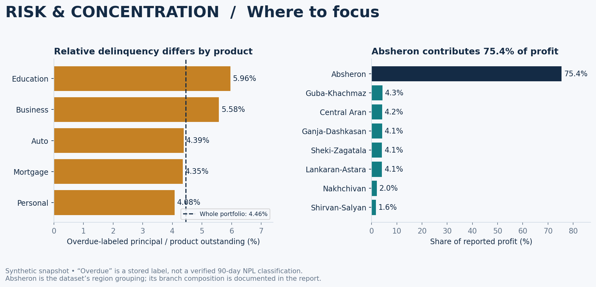
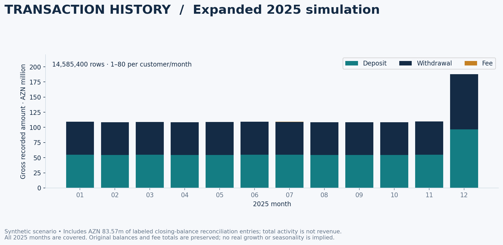

# Alov Bank — Financial and operating assessment

**Prepared: 5 October 2026. Source: the supplied synthetic export; financial rows labeled 2025.**
The bank name is pending. Amounts are AZN unless indicated. Financial calculations use the exported snapshot. Activity statistics use the expanded 2025 scenario; this is not an assumed post-upgrade operational state.

## Assessment

Alov Bank is a profitable retail-banking simulation with a substantial deposit base and a mortgage-led loan book. The strongest evidence is the combination of positive modeled profit across all branches and internally consistent customer balances. The main business weaknesses are concentration in mortgages, interest earnings and one regional grouping. The expanded activity is random but still synthetic: its uniform count rule and deliberate balance-reconciliation entries cannot support empirical claims about customer growth, seasonality or collections.

The appropriate conclusion is **a coherent financial scenario and an increasingly controlled operations prototype**. It is not evidence of the performance, safety or competitiveness of an actual bank.

## 1. Scale and business mix

The database contains 30,000 customers, 45,449 accounts, 16,000 loans and 14,585,400 transactions in the expanded history (363,592 in the original seed). All 45,449 accounts have corresponding banking-control records. The branch network covers 25 branches and 14 cities, with 613 employees represented as branch counts.

Account balances total **AZN 1,139,873,847.61**. Original loan amounts total **AZN 1,397,486,558.29**, while remaining principal is **AZN 885,501,530.84**. The remaining principal is the correct numerator for the snapshot loan-to-deposit calculation; original amounts also include lending that has already been repaid.

| Account product | Accounts | Balance · AZN m | Share of balances |
| --- | --- | --- | --- |
| Savings | 12,488 | 603.32 | 52.93% |
| Salary | 16,420 | 266.94 | 23.42% |
| Current | 11,685 | 190.49 | 16.71% |
| Business | 4,856 | 79.12 | 6.94% |

Savings accounts hold 52.93% of balances, although they represent only 27.48% of accounts. Salary accounts form the largest account group by count. Together, savings and salary balances account for approximately 76.35% of deposits. This supports the proposed retail positioning.

The top ten deposit customers collectively hold approximately 0.194% of balances. That suggests low individual depositor concentration **within the generated data**, but does not establish stable funding: contractual maturities, withdrawal behavior and insurance coverage are unavailable.

## 2. Profitability and earnings quality

| Measure | AZN |
| --- | --- |
| Interest Income | 88,063,450.45 |
| Fee Income | 408,591.38 |
| Other Income | 1,931,582.50 |
| Total Revenue | 90,403,624.33 |
| Interest Expense | 19,568,811.23 |
| Operating Expense | 35,059,824.17 |
| Total Expenses | 54,628,635.40 |
| Net Profit | 35,774,988.93 |

Reported model profit is **AZN 35.77 million**, equivalent to **39.57% of gross revenue**. All 25 branches report positive profit; the smallest branch contribution is AZN 376,795.05. These are attractive results inside the scenario, but the dataset was constructed for training and cannot serve as independent evidence of commercial success.

### A correct expense comparison

Net interest income is AZN 68.49 million. Adding fee and other income gives **AZN 70.83 million of operating income after interest cost**. Dividing operating expenses by that amount gives **49.50%**. This is the operating cost-to-income measure used here.

Total expenses divided by gross revenue gives **60.43%**. That is a different measure because interest expense appears in its numerator. Reporting these two calculations under the same label would mislead a reader.

### Earnings are highly concentrated

Interest income accounts for **97.41%** of revenue; fees account for **0.45%** and other income for **2.14%**. The bank's earnings therefore depend heavily on lending margins. A useful strategic objective would be to investigate additional services and customer needs that could support non-interest revenue. The data cannot identify which new product would succeed, and higher fees are not automatically the right response.

### What the reported profit does not prove

The aggregate interest-income figure is within AZN 0.03 of a one-year calculation using **Active loan principal × annual interest rate**. Deposit-interest expense is within AZN 0.02 of **account balance × annual rate**. These near matches strongly suggest annualized modeling; the export does not provide a generator specification establishing the exact formula.

Only deposits, withdrawals and fees appear in historical transactions. There are no recorded historical interest or loan-payment transactions to prove cash collection. Therefore the financial summaries must be described as **modeled annual financial figures**, not as fully reconciled cash earnings.

The field `net_profit` is revenue minus recorded expenses. There are no separate tax, impairment or provisioning fields. Do not label it audited net income, after-tax profit, ROA or ROE. Total assets, verified equity and average-period balances are missing.

## 3. Funding and liquidity interpretation

Outstanding loans divided by deposits equal **77.68%**. The difference between deposits and loans is AZN 254,372,316.77. That difference is **not necessarily available cash**: the model does not show how all funding is invested or other obligations that may exist.

The ratio shows that the modeled loan book is smaller than deposit funding. It does not establish liquidity coverage, maturity matching, capital adequacy or resilience to withdrawals. Savings balances may reprice or leave; mortgages may remain outstanding for much longer. Deposit tenor, loan repricing terms and a complete liquidity balance sheet are needed to analyze that risk.

## 4. Credit exposure: concentration versus arrears

| Loan product | Records | Outstanding · AZN m | Share of principal | Overdue · AZN m | Overdue / product |
| --- | --- | --- | --- | --- | --- |
| Mortgage | 6,229 | 651.02 | 73.52% | 28.34 | 4.35% |
| Business | 652 | 83.62 | 9.44% | 4.66 | 5.58% |
| Auto | 2,853 | 73.85 | 8.34% | 3.24 | 4.39% |
| Personal | 5,625 | 72.12 | 8.14% | 2.94 | 4.08% |
| Education | 641 | 4.90 | 0.55% | 0.29 | 5.96% |

**Mortgage concentration is the central exposure.** Mortgages account for 73.52% of remaining principal and AZN 28.34 million of the overdue-labeled balance. Even with a lower overdue share than business or education lending, their size makes them the largest source of absolute overdue exposure.

**Business and education lending need different attention.** Their overdue shares are 5.58% and 5.96%, respectively. Business loans contribute AZN 4.66 million of overdue exposure. Education has the highest rate but only AZN 0.29 million in overdue balances; ranking products by percentage alone would overstate its absolute importance.

Across the portfolio, 636 loan records are labeled Overdue. Their remaining principal totals **AZN 39.48 million**, or **4.46% of total outstanding principal**. The overdue count is 3.98% of all loan records, including 1,372 paid loans. The exposure-weighted ratio answers a different question and is the headline measure here.

This is **not a verified NPL ratio**. The baseline contains no installment schedules, actual missed-payment dates, collateral valuations, provisions or recoveries. It cannot establish days past due, impairment stages or expected losses.

Customer risk labels also have limits. High-risk customers hold approximately 6.87% of outstanding principal, but Low-risk customers hold the largest absolute overdue balance because they make up most of the book. The stored labels have no documented scoring model, so they should not be presented as independently validated risk assessments.

## 5. Branch performance and geographic dependence

Absheron contains 12 of the 25 branches and contributes **75.41% of reported profit**. The five most profitable branches together contribute **38.73%**. Baku alone accounts for **57.14% of customer records**. These are different measures: city-level customer concentration and dataset-defined regional profit concentration should not be conflated.

| Top branch by absolute profit | Profit · AZN m | Profit / revenue | Employees |
| --- | --- | --- | --- |
| Baku North | 3.025 | 52.90% | 22 |
| Baku Premium | 2.800 | 49.71% | 27 |
| Baku South | 2.745 | 55.79% | 18 |
| Narimanov | 2.660 | 51.36% | 20 |
| Central Baku | 2.626 | 52.98% | 20 |

Baku North is the leading branch by absolute profit. Baku South has the highest profit margin among these five, illustrating why absolute profit and efficiency are separate dimensions. Aghjabadi is the smallest profit contributor at AZN 0.377 million, but still positive in the model.

The defensible next step is a branch review using several measures: contribution, cost-to-income, customer coverage, credit quality and local opportunity. The data does not justify automatically closing a low-profit branch: differences in customer needs, strategic coverage, centralized cost allocations and branch age may matter.

## 6. Expanded transaction activity: varied volume with transparent constraints

The owner requested **1–80 transactions per customer per month**. The generator independently samples that count for each of the 30,000 customers in each of 12 months, then distributes the rows across the customer's accounts. The rule is per customer, not per account.

The result is **14,585,400 rows covering 1 January–31 December 2025**. All 360,000 customer-month combinations are present. Customer annual counts range from 167 to 797; account annual counts range from 47 to 785. Those ranges reflect this fixed-seed run, not guaranteed ranges for every possible random seed.

| Type | Rows | Gross amount · AZN |
| --- | ---: | ---: |
| Deposit | 7,271,338 | 696,970,950.34 |
| Withdrawal | 7,268,613 | 689,589,298.17 |
| Fee | 45,449 | 408,591.38 |

Gross throughput is AZN 1,386,968,839.89. It is **not revenue**, and it should not be compared with the original smaller transaction history as organic bank growth. The expanded data is a replacement simulation.

### Preserved balances and disclosed adjustments

The generator retains the existing account closing balances and original fees. Each account has one clearly labeled `Synthetic closing-balance reconciliation` entry at its final activity date. There are **45,449 such entries**, with a gross amount of **AZN 83.57 million**. They are deposits or withdrawals used to reconcile a generated path to the specified snapshot—not independent customer spending or cashflow evidence.

These entries represent approximately 6.03% of gross activity. Report them separately when exploring behavior; do not hide them. The charts distinguish the source of those adjustments through annotations, and the analysis queries expose them explicitly.

Generation replay checks verify nonnegative running balances, exact final balances and unchanged fee totals. The original account/loan/customer/branch records and financial summaries are retained. The higher transaction count does not automatically increase revenue or profitability.

### What improved, and what remains artificial

The original seed assigned every account exactly four deposits, three withdrawals and one fee, with activity types confined to different parts of 2025. The expanded history removes that fixed eight-row pattern and completes the year. However, uniform monthly counts are still a design instruction, not measured behavior. Fees still occur once per account, and contractual loan payments and paired transfers are not invented.

The model therefore supports SQL volume practice, account reconciliation and illustrative monthly analysis. It does not validate customer retention, market growth, seasonality or real credit collection performance.

## 7. What the bank and the project do well

| Strength supported by the data | Evidence | Appropriate interpretation |
| --- | --- | --- |
| Positive modeled earnings throughout the network | All 25 branch rows show profit | A coherent profitable scenario; no real-world performance claim |
| Broad customer and account coverage | 30,000 customers, four account products | Useful scope for customer/product analysis |
| Deposit funding exceeds the loan book | 77.68% loan-to-deposit ratio | Headline funding position; no regulatory liquidity conclusion |
| Low modeled top-name concentration | Top ten borrowers hold about 0.635% of outstanding principal | Limited single-name concentration in this synthetic construction |
| Internally consistent balances | All account balances reconcile to opening balances and signed transactions | Strong arithmetic integrity of the supplied snapshot |
| Consistent branch rollups | All 25 branch deposit and outstanding-loan totals match the detail | Reports and underlying balance records agree |
| Traceable future operations | V2 posts customer entries and balanced GL entries atomically | A demonstrable engineering feature once installed |

## 8. Weaknesses and missing evidence

| Weakness | Why it matters | Response |
| --- | --- | --- |
| Mortgage concentration | One product dominates credit exposure | Add collateral, LTV and borrower-affordability analysis before proposing new lending |
| Interest-income dependence | Small non-interest buffer | Analyze customer needs and sustainable service revenue |
| Geographic concentration | Most profit comes from one region grouping | Track regional exposure and stress scenarios |
| Incomplete historical cashflows | Annual income cannot be fully traced to transactions | Add accrual and settlement records tied to the ledger |
| Missing repayment history | Cannot measure true delinquency or collection effectiveness | Load approved schedules and dated repayment allocations |
| Synthetic activity rules and closing adjustments | Randomness alone does not establish real behavior | Separate adjustments and document product/customer distributions |
| No complete financial statements | Cannot calculate verified capital or returns on equity/assets | Add a complete chart of accounts, opening balances and period close |
| Controls need operational evidence | Stored procedures alone do not prove adoption | Capture genuine post-installation outputs and permission tests |

## 9. Illustrative sensitivity—not a forecast or regulatory stress test

Two simple calculations show how large exposures can affect the reported model profit:

- A **one-percentage-point additional loss on mortgage principal** would equal approximately AZN 6.51 million, or 18.20% of reported model profit, before tax, recoveries or other effects. This is an assumed incremental loss, not a prediction of defaults.
- A **one-percentage-point increase in savings-account cost for a full year**, with balances unchanged and no change in loan income, would add approximately AZN 6.03 million of expense—16.86% of reported model profit.

Neither calculation models repricing dates, customer reactions, hedging, collateral recovery or provisions already held. The scenario assumptions are deliberately explicit so they can be challenged or extended.

## 10. Recommended direction

**First: make the evidence stronger.** Install and verify V2, retain the export, publish the metric definitions, and capture authentic results. Keep the expanded scenario separate from observed historical claims before presenting trends.

**Second: complete the lending story.** Add documented contractual schedules, repayment history, overdue aging, collateral and provisioning assumptions. Keep legacy loan records separate from new operational postings until they reconcile.

**Third: improve the accounting story.** Extend from transaction-level journals to a complete balance sheet, expense posting, loan-interest accrual and controlled period close. Resolve the migration offset rather than presenting it as verified capital.

**Fourth: examine diversification.** Use the improved evidence to assess mortgage, regional and earnings concentration. Avoid claiming that more business lending or higher fees is automatically beneficial.

The bank's clearest strengths are profitability within the modeled assumptions and consistent underlying balances. Its clearest limitations are concentration and missing evidence needed to assess real banking risk. Presenting both makes this a stronger finance portfolio than presenting profit alone.

## Metric definitions and reproduction

See [03_analysis_queries.sql](../sql/03_analysis_queries.sql) for MySQL queries and [analyze.py](../analysis/analyze.py) for the exact seed extraction, and [generate_history.py](../analysis/generate_history.py) for the expanded transaction scenario. Monetary source fields are parsed as integer cents before aggregation. Percentages are calculated from unrounded totals; table presentation is rounded. No industry benchmarks are used.
