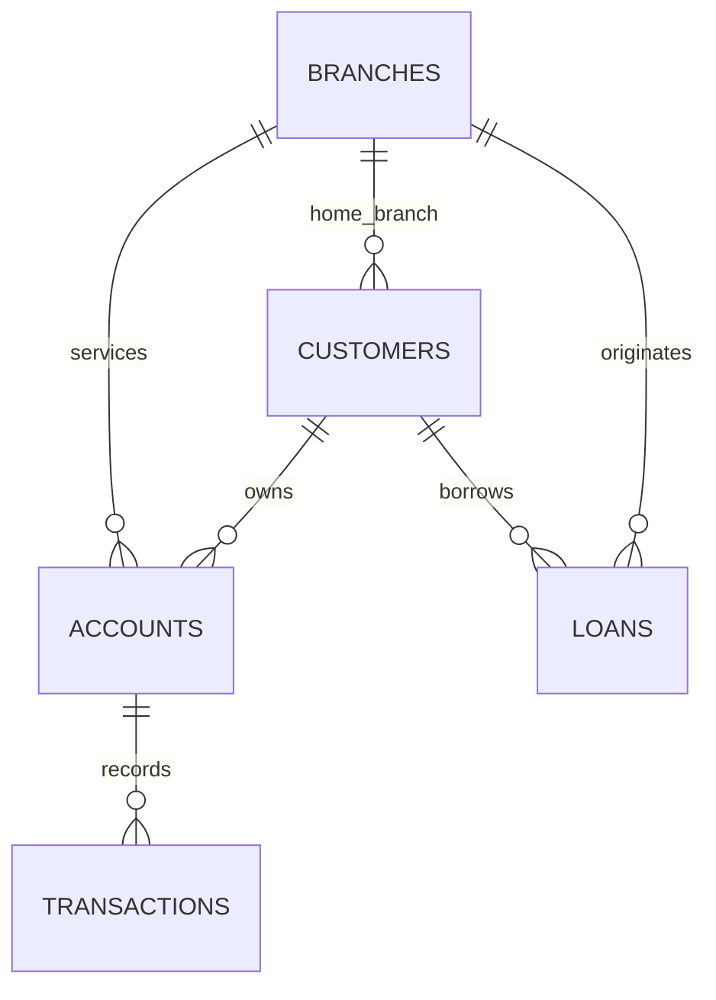
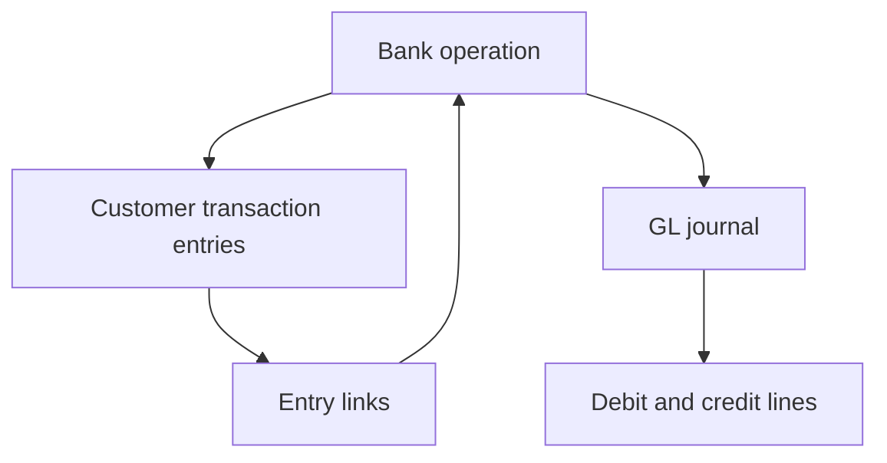
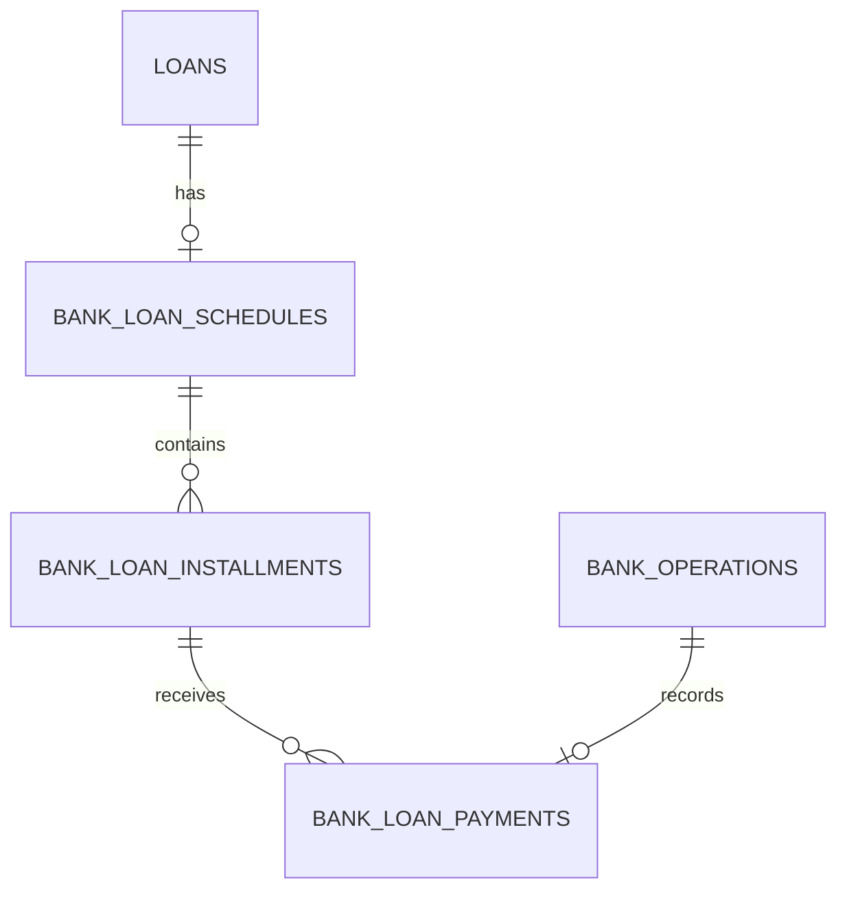

# Data model

## Core customer and product model

Transactions also store customer_id and branch_id. These must match the related account; the V2 insert validation enforces that consistency for new entries. The historical data checks verify it independently.

## New operation and accounting records

A single operation can produce two customer entries for a transfer. Its GL journal has balanced debit/credit lines. The posting procedures commit both layers together; a ledger failure rolls back the customer change. Reversals create a new operation linked to the original.

## Loan servicing records

`branch_financials` is a separate annual summary table. Its balances reconcile to the snapshot detail, but its income is not a complete historical ledger. See the financial analysis for this distinction.
